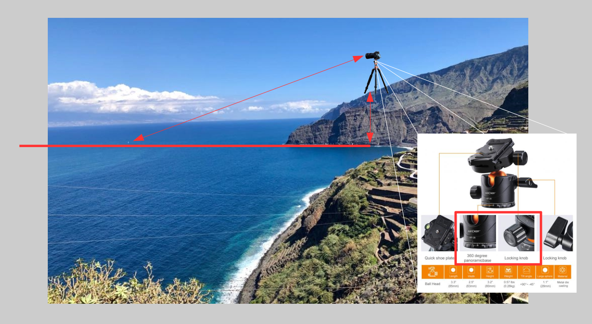
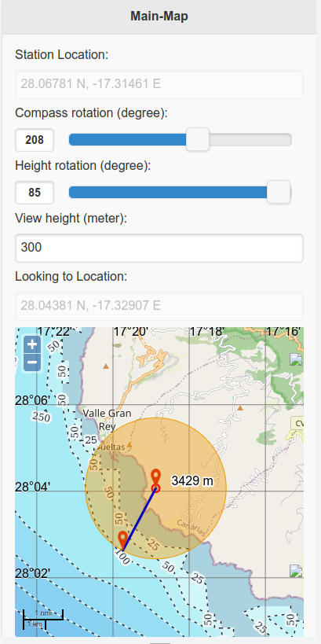

# BSP - Binocular sight point
<div align="center">
<br>

[](https://www.gnu.org/licenses/gpl-3.0)
[](https://liberapay.com/StefanWerf/donate)
</div>


## Description
This project is intended to calculate the position in which direction to look with binoculars. The exact position can be calculated based on the height to sea level, orientation to the north with an angle for horizontal (0-360 degrees) and with a tilt angle (up to 0-90 degrees) for vertical.

## Implementation
* OpenStreetMap
* JQuery, JQueryMobile
* HTML5 (for Mobile optimized)
* Map supplement with sea depth

### Example diagram


### Screenshot


## Help the project

- help the association [M.e.e.r e.V.](https://m-e-e-r.de/)
- you can program, you have ideas, then help us here, foke us and improve the code :) or write to us, we like to listen.
- how can you still help?
    - [Buy us a coffee](https://www.buymeacoffee.com/mwpa)
    - Donate (see on [M.e.e.r e.V.](https://m-e-e-r.de/) page)
    - Donate crypto coins
        - for Networks: [ETH](https://ethereum.org/en/), [BSC](https://www.binance.com/en), [Polygon](https://polygon.technology/): ```0x0bF915d5fbD65e42bd2DeD3d056752938F7174a7```

## License

[](https://www.gnu.org/licenses/gpl-3.0)

This project is licensed under the GNU General Public License v3.0. See the [LICENSE](LICENSE) file for details.